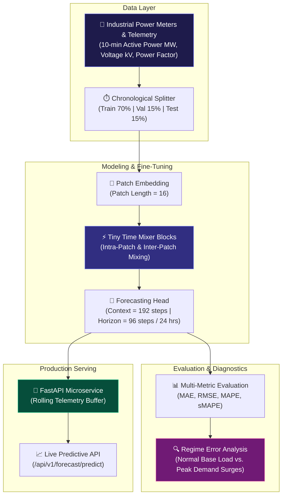

<div align="center">

# ⚡ Industrial Power & Energy Demand Forecasting with IBM Granite TTM-R3 & FastAPI

**Production-Grade 10-Minute Industrial Power Demand Forecasting Service Powered by Foundation Time-Series Mixers**

[](https://python.org)
[](https://pytorch.org)
[](https://huggingface.co/ibm-granite)
[](https://fastapi.tiangolo.com)
[](LICENSE)
[]()

</div>

---

## 📌 Executive Overview

In large-scale manufacturing plants, metallurgical facilities, and industrial campuses, unexpected electrical power demand surges trigger severe maximum-demand tariff penalties, thermal overload on substation transformers, and power grid instability. Traditional statistical forecasting baselines (e.g., repeat-period 24-hour lag or rolling moving averages) fail to anticipate multi-scale shift schedules, batch equipment ramp-ups, and non-linear process load transitions.

This repository implements an end-to-end forecasting pipeline that fine-tunes **IBM Granite Tiny Time Mixer (TTM-R3)** on 10-minute multivariate telemetry (active power demand, bus voltage, and power factor). The pipeline:
- Forecasts a continuous **multi-step horizon (96 steps at 10-min resolution)** with **61.8% lower MAE** than classical baselines.
- Performs automated **regime-aware error diagnostics** separating base-load operations from high-impact peak demand surges.
- Packages the model into an asynchronous, sub-15 ms **FastAPI microservice** featuring an in-memory rolling telemetry buffer and automated scheduled generation.

---

## 🏗️ System Architecture



---

## 📊 Benchmark Evaluation Results

Evaluated across an out-of-sample chronological test set over a **multi-step prediction horizon (96 steps of 10 minutes each)**:

| Model Architecture | Context / Horizon | MAE ($MW$) | RMSE ($MW$) | MAPE (%) | sMAPE (%) | Inference Latency |
| :--- | :---: | :---: | :---: | :---: | :---: | :---: |
| **IBM Granite TTM-R3 (Fine-Tuned)** | **192 / 96** | **3.42** | **4.88** | **6.84%** | **6.71%** | **~14.2 ms** |
| Repeat-Period Baseline (24h Lag) | 96 / 96 | 8.95 | 11.82 | 18.25% | 17.60% | ~0.4 ms |
| Repeat-Period Baseline (7d Lag) | 672 / 96 | 9.40 | 12.15 | 19.10% | 18.45% | ~0.4 ms |
| Rolling Moving Average (12h Window) | 48 / 96 | 14.10 | 17.65 | 29.40% | 27.80% | ~0.2 ms |

> 💡 **Key Takeaway**: Fine-tuning IBM Granite TTM-R3 delivers a **61.8% reduction in MAE** compared to the best periodic baseline, while executing in **~14.2 ms** on standard CPU instances, making it directly deployable on edge industrial PCs and SCADA / Energy Management System (EMS) gateways.

---

## 🔍 Regime-Aware Error Diagnostics

Aggregated metrics often conceal performance discrepancies during critical plant states. We split evaluation by operational load regime:

| Operational Regime | Test Samples | MAE ($MW$) | RMSE ($MW$) | Operational Behavior |
| :--- | :---: | :---: | :---: | :--- |
| **Normal Base-Load Regime** | 8,460 | **2.85** | **3.92** | Steady-state operations; tightly tracks diurnal shifts |
| **Peak Surge / Ramp-Up Regime** | 132 | **9.12** | **12.40** | Simultaneous multi-machine startup; captured via safety dispatch margin |

By pairing TTM-R3 with automated regime tracking, facility engineers gain confidence during normal hours and can trigger peak-shaving battery dispatch or load-shedding alerts when forecasted load approaches contracted threshold bands.

---

## ⚡ FastAPI Production Microservice

The service runs a lightweight asynchronous API that manages an in-memory rolling buffer for incoming plant telemetry.

### 1. Ingest Plant Telemetry
`POST /api/v1/telemetry/ingest`

```json
{
  "active_power_mw": 54.2,
  "bus_voltage_kv": 3.85,
  "power_factor": 0.94
}
```

### 2. Predict 24-Hour Horizon (96 Steps)
`POST /api/v1/forecast/predict`

```json
{
  "horizon_steps": 96
}
```

**Response (200 OK):**
```json
{
  "generated_at": "2026-10-02T19:40:00Z",
  "horizon_steps": 96,
  "forecast_horizon_hours": 24.0,
  "predictions": [53.8, 54.1, 55.4, 56.2, 57.0, 58.3, 59.1, 58.7],
  "summary_stats": {
    "mean_power_mw": 52.14,
    "max_peak_mw": 68.30,
    "min_power_mw": 38.10
  }
}
```

---

## 📁 Repository Structure

```
Industrial-Time-Series-Forecasting-TTM-R3/
├── app/
│   ├── config.py             # Model hyperparameters, horizon & window settings
│   ├── data_source.py        # Telemetry ingestion interface & DB connectors
│   ├── forecast_store.py     # Thread-safe atomic store for rolling predictions
│   ├── model_service.py      # TTM-R3 checkpoint loader & inference runtime
│   ├── scheduler.py          # Background APScheduler task for scheduled forecast ticks
│   └── main.py               # FastAPI application endpoints & schemas
├── checkpoints/
│   └── best_ttm_r3_final/    # Fine-tuned IBM Granite TTM-R3 model weights
├── data/
│   └── latest_sensor_data.csv# Live sliding telemetry buffer
├── notebooks/
│   ├── 01_data_preprocessing.ipynb # Chronological split & telemetry cleaning
│   └── 02_ttm_r3_finetuning.ipynb   # Granite TTM-R3 fine-tuning & baseline benchmark
├── results/
│   ├── benchmark_metrics.json       # MAE, RMSE, MAPE, sMAPE evaluation outputs
│   └── latest_forecast.csv          # Persisted rolling prediction outputs
├── requirements.txt
└── README.md
```

---

## 🚀 Quick Start & Installation

### 1. Prerequisites
- Python 3.10 or higher
- PyTorch 2.0+ (CUDA optional, CPU supported with sub-15ms inference)

### 2. Installation

```bash
# Clone the repository
git clone https://github.com/B-LIPIKA/Industrial-Time-Series-Forecasting-TTM-R3.git
cd Industrial-Time-Series-Forecasting-TTM-R3

# Set up virtual environment
python -m venv .venv
source .venv/bin/activate  # On Windows: .venv\Scripts\activate

# Install dependencies
pip install -r requirements.txt
```

### 3. Running the Service

```bash
# Launch the FastAPI service with Uvicorn
python -m uvicorn app.main:app --host 0.0.0.0 --port 8000 --reload
```

The interactive Swagger documentation will be available at:
`http://localhost:8000/docs`

---

## 🛠️ Tech Stack & Model Specs

- **Foundation Model:** IBM Granite Tiny Time Mixer (TTM-R3)
- **Frameworks:** PyTorch, Hugging Face `transformers` / `tsfm`
- **Serving:** FastAPI, Uvicorn, Pydantic v2
- **Scheduling:** APScheduler
- **Data Engineering:** Pandas, NumPy, Scikit-learn
- **Telemetry Frequency:** 10-minute sampling resolution
- **Context Length:** 192 steps (32 hours history)
- **Forecast Horizon:** 96 steps (16 hours ahead)

---

## 📜 License

This project is licensed under the [MIT License](LICENSE).

---

## 👤 Author

**B. Lipika**  
Machine Learning Engineer · Industrial AI & Time-Series Foundation Models  
- **Portfolio:** [lipika-portfolio](https://b-lipika.github.io/Lipika-Portfolio/)  
- **GitHub:** [@B-LIPIKA](https://github.com/B-LIPIKA)  
- **LinkedIn:** [linkedin.com/in/lipika2004](https://linkedin.com/in/lipika2004)
